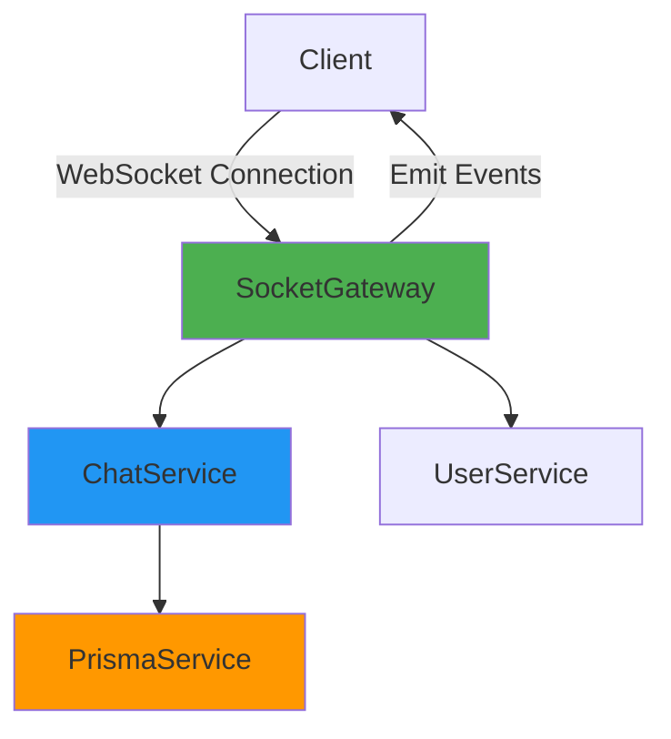
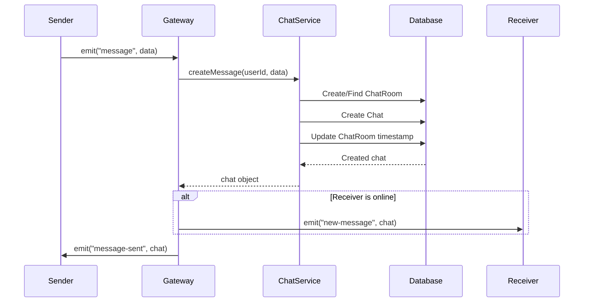
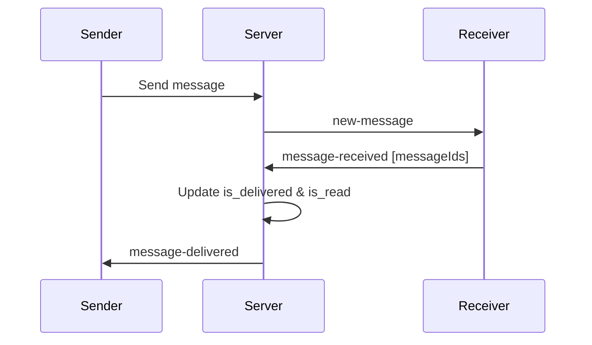

# Socket Implementation Documentation

## Overview

This messaging application uses **Socket.IO** with **NestJS WebSocket Gateway** to enable real-time bidirectional communication between clients and the server. The implementation supports instant messaging, delivery tracking, and chat room management.

---

## Architecture

### Technology Stack

- **Framework**: NestJS v11.0.1
- **WebSocket Library**: Socket.IO v4.8.3
- **Platform Adapter**: @nestjs/platform-socket.io v11.1.12
- **Database**: Prisma ORM with MongoDB

### Gateway Structure



---

## Gateway Configuration

### Main Chat Gateway

**File**: [chat.gateway.ts](file:///d:/projects/ongoing/messeging-app/src/modules/chat/gateway/chat.gateway.ts)

```typescript
@WebSocketGateway({
    cors: {
        origin: "http://10.10.20.44:3000"
    }
})
```

**Configuration Details**:
- **CORS Origin**: `http://10.10.20.44:3000`
- **Validation**: Enabled with `ValidationPipe` (transform & whitelist)
- **Namespace**: Default (`/`)

### Admin Gateway

**File**: [admin.gateway.ts](file:///d:/projects/ongoing/messeging-app/src/modules/chat/gateway/admin.gateway.ts)

```typescript
@WebSocketGateway({
    namespace: "/admin", 
    cors: "*"
})
```

> [!NOTE]
> The Admin Gateway is currently a placeholder with unimplemented methods.

---

## Connection Lifecycle

### 1. Connection Establishment

async handleConnection(client: Socket, ...args: any[])

**Flow**:

1. Client connects with `userId` in query parameters
2. Server validates user existence via `UserService`
3. User-to-socket mapping is stored in `usersSocket` Map
4. `userId` is attached to `client.data` for future reference
5. Success event is emitted to client

**Query Parameters**:
| Parameter | Type | Required | Description |
|-----------|------|----------|-------------|
| `userId` | string | ✅ | MongoDB ObjectId of the user |

**Success Response**:
```typescript
{
    event: "success",
    data: { message: "User Successfully Connected With Socket" }
}
```

**Error Response**:
```typescript
{
    event: "error",
    data: "use not found" // or other error message
}
```

> [!IMPORTANT]
> If authentication fails, the client is automatically disconnected.

### 2. Active Connection

During an active connection:
- User's socket ID is stored in `usersSocket` Map: `Map<userId, socketId>`
- `client.data.userId` stores the authenticated user ID
- Client can send/receive real-time messages

### 3. Disconnection

**Event**: `handleDisconnect`

```typescript
handleDisconnect(client: Socket)
```

**Flow**:
1. Retrieve `userId` from `client.data.userId`
2. Remove user from `usersSocket` Map
3. Log disconnection

---

## Events System

### Event Enums

**File**: [events.enum.ts](file:///d:/projects/ongoing/messeging-app/src/modules/chat/enums/events.enum.ts)

#### Server Emit Events (Server → Client)

| Event | Enum Value | Description |
|-------|------------|-------------|
| `NEW_MESSAGE` | `"new-message"` | New message received from another user |
| `MESSAGE_SENT` | `"message-sent"` | Confirmation that your message was sent |
| `MESSAGE_DELIVERED` | `"message-delivered"` | Message was delivered to recipient |
| `MESSAGE_READ` | `"message-read"` | Message was read by recipient |
| `ALL_CHAT_ROOMS` | `"all-chat-rooms"` | List of user's chat rooms |
| `ALL_MESSAGES` | `"all-messages"` | Messages from a specific room |
| `SUCCESS` | `"success"` | Generic success notification |
| `ERROR` | `"error"` | Error notification |

#### Client Subscribe Events (Client → Server)

| Event | Enum Value | Description |
|-------|------------|-------------|
| `MESSAGE` | `"message"` | Send a new message |
| `MESSAGE_RECEIVED` | `"message-received"` | Acknowledge message delivery |
| `FETCH_CHAT_ROOMS` | `"fetch-chat-rooms"` | Request user's chat rooms |
| `FETCH_MESSAGES` | `"fetch-messages"` | Request messages from a room |
| `SEND_FILE` | `"send-file"` | Send file attachment |

---

## Message Flow

### Sending a Message

**Event**: `message`

**Handler**: [chat.gateway.ts:L100-116](file:///d:/projects/ongoing/messeging-app/src/modules/chat/gateway/chat.gateway.ts#L100-L116)

**Request DTO**: [SendMessageDto](file:///d:/projects/ongoing/messeging-app/src/modules/chat/dtos/send-message.dto.ts)

```typescript
{
    receiver_id: string,  // MongoDB ObjectId
    message: string,      // Message content
    file?: FileBuffer     // Optional file attachment
}
```

**Process Flow**:



**Response Events**:

1. **To Sender**: `message-sent`
   ```typescript
   {
       id: string,
       chatRoom_id: string,
       sender_id: string,
       receiver_id: string,
       message: string,
       is_delivered: boolean,
       is_read: boolean,
       createdAt: Date
   }
   ```

2. **To Receiver** (if online): `new-message`
   - Same structure as above

### Fetching Chat Rooms

**Event**: `fetch-chat-rooms`

**Handler**: [chat.gateway.ts:L156-173](file:///d:/projects/ongoing/messeging-app/src/modules/chat/gateway/chat.gateway.ts#L156-L173)

**Request DTO**: [GetUserRoomsDto](file:///d:/projects/ongoing/messeging-app/src/modules/chat/dtos/get-user-rooms.dto.ts)

```typescript
{
    page: number,   // Page number (default: 1)
    limit: number   // Items per page (default: 10)
}
```

**Response Event**: `all-chat-rooms`

```typescript
{
    rooms: [
        {
            id: string,
            user1_id: string,
            user2_id: string,
            createdAt: Date,
            updatedAt: Date,
            otherUser: {
                id: string,
                nick_name: string,
                licence_id: string,
                avatar: string
            },
            latest_message: {
                id: string,
                message: string,
                createdAt: Date,
                is_mine: boolean,
                is_delivered: boolean,
                is_read: boolean
            },
            unread_count: number
        }
    ],
    total: number
}
```

### Fetching Messages

**Event**: `fetch-messages`

**Handler**: [chat.gateway.ts:L175-192](file:///d:/projects/ongoing/messeging-app/src/modules/chat/gateway/chat.gateway.ts#L175-L192)

**Request DTO**: [GetAllMessagesDto](file:///d:/projects/ongoing/messeging-app/src/modules/chat/dtos/get-all-messages.dto.ts)

```typescript
{
    roomId: string,  // MongoDB ObjectId
    page: number,
    limit: number
}
```

**Response Event**: `all-messages`

```typescript
{
    messages: [
        {
            id: string,
            chatRoom_id: string,
            sender_id: string,
            receiver_id: string,
            message: string,
            is_delivered: boolean,
            is_read: boolean,
            createdAt: Date,
            is_mine: boolean,
            sender: {
                id: string,
                nick_name: string,
                avatar: string
            },
            receiver: {
                id: string,
                nick_name: string,
                avatar: string
            }
        }
    ],
    total: number
}
```

> [!NOTE]
> When fetching messages, all unread messages in that room are automatically marked as read.

---

## Delivery Tracking

### Message Acknowledgement

**Event**: `message-received`

**Handler**: [chat.gateway.ts:L119-130](file:///d:/projects/ongoing/messeging-app/src/modules/chat/gateway/chat.gateway.ts#L119-L130)

**Request DTO**: [MessageAcknowledgementDto](file:///d:/projects/ongoing/messeging-app/src/modules/chat/dtos/message-acknowledgement.dto.ts)

```typescript
{
    messageIds: string[]  // Array of message IDs
}
```

**Process**:
1. Client receives messages
2. Client sends acknowledgement with message IDs
3. Server updates `is_delivered` and `is_read` to `true`
4. Server notifies original sender via `message-delivered` event

**Flow Diagram**:



---

## Data Models

### Chat Room Model

```typescript
{
    id: string,
    user1_id: string,  // Sorted user ID (lower)
    user2_id: string,  // Sorted user ID (higher)
    createdAt: Date,
    updatedAt: Date
}
```

> [!IMPORTANT]
> Chat rooms use sorted user IDs to prevent duplicate rooms. The system ensures `user1_id < user2_id` alphabetically.

### Chat Message Model

```typescript
{
    id: string,
    chatRoom_id: string,
    sender_id: string,
    receiver_id: string,
    message: string,
    is_delivered: boolean,  // Default: false
    is_read: boolean,       // Default: false
    createdAt: Date
}
```

---

## Client Integration

### Connection Example

```javascript
import { io } from 'socket.io-client';

const socket = io('http://10.10.20.44:3000', {
    query: {
        userId: 'your-mongodb-user-id'
    }
});

// Listen for connection success
socket.on('success', (data) => {
    console.log(data.message);
});

// Listen for errors
socket.on('error', (error) => {
    console.error('Connection error:', error);
});
```

### Sending a Message

```javascript
socket.emit('message', {
    receiver_id: 'receiver-user-id',
    message: 'Hello, World!'
});

// Listen for confirmation
socket.on('message-sent', (chat) => {
    console.log('Message sent:', chat);
});
```

### Receiving Messages

```javascript
socket.on('new-message', (chat) => {
    console.log('New message received:', chat);
    
    // Acknowledge receipt
    socket.emit('message-received', {
        messageIds: [chat.id]
    });
});
```

### Fetching Chat Rooms

```javascript
socket.emit('fetch-chat-rooms', {
    page: 1,
    limit: 20
});

socket.on('all-chat-rooms', (data) => {
    console.log('Chat rooms:', data.rooms);
    console.log('Total rooms:', data.total);
});
```

### Fetching Messages

```javascript
socket.emit('fetch-messages', {
    roomId: 'chat-room-id',
    page: 1,
    limit: 50
});

socket.on('all-messages', (data) => {
    console.log('Messages:', data.messages);
    console.log('Total messages:', data.total);
});
```

---

## Internal State Management

### User-Socket Mapping

The gateway maintains an in-memory Map to track online users:

```typescript
private usersSocket: Map<string, string>
// Key: userId (string)
// Value: socketId (string)
```

**Purpose**:
- Quickly lookup if a user is online
- Route messages to the correct socket connection
- Clean up on disconnection

**Limitations**:
> [!WARNING]
> This in-memory Map will be lost on server restart. For production, consider using Redis for persistent connection tracking across multiple server instances.

---

## Service Layer

### ChatService

**File**: [chat.service.ts](file:///d:/projects/ongoing/messeging-app/src/modules/chat/chat.service.ts)

**Key Methods**:

| Method | Description | Returns |
|--------|-------------|---------|
| `createMessage` | Creates a new message and chat room if needed | Chat object |
| `getUserChatRooms` | Fetches user's chat rooms with pagination | Rooms array + total |
| `getRoomMessages` | Fetches messages from a room with pagination | Messages array + total |
| `acknowledgeMessageDelivery` | Marks message as delivered and read | Updated chat |

**Auto-Room Creation**:
- When a message is sent, the system automatically creates a chat room if one doesn't exist
- Uses sorted user IDs to prevent duplicates

---

## Error Handling

### Connection Errors

```typescript
// Invalid user
client.emit('error', 'use not found');
client.disconnect();
```

### Validation Errors

All DTOs use `class-validator` decorators:
- `@IsMongoId()` - Validates MongoDB ObjectIds
- `@IsString()` - Validates string types
- `@IsNotEmpty()` - Ensures non-empty values
- `@IsArray()` - Validates arrays

Invalid data triggers automatic validation errors via `ValidationPipe`.

---

## Module Configuration

**File**: [chat.module.ts](file:///d:/projects/ongoing/messeging-app/src/modules/chat/chat.module.ts)

```typescript
@Module({
    imports: [UserModule],
    controllers: [ChatController],
    providers: [ChatService, PrismaService, SocketGateway],
    exports: [ChatService]
})
```

**Dependencies**:
- `UserModule` - For user validation
- `PrismaService` - Database operations
- `SocketGateway` - WebSocket handling

---

## Best Practices

### For Clients

1. **Always acknowledge message receipt** to update delivery status
2. **Handle reconnection logic** for network interruptions
3. **Implement exponential backoff** for connection retries
4. **Store userId securely** for connection authentication

### For Server

1. **Validate all incoming data** using DTOs
2. **Use transactions** for critical database operations
3. **Implement rate limiting** to prevent abuse
4. **Add logging** for debugging connection issues

---

## Future Enhancements

> [!TIP]
> Consider these improvements for production:

1. **Redis Integration**: Store user-socket mappings in Redis for multi-server support
2. **Message Queue**: Use RabbitMQ/Redis for reliable message delivery
3. **Typing Indicators**: Add real-time typing status
4. **Read Receipts**: Separate `is_read` from `is_delivered`
5. **File Upload**: Complete the `send-file` event implementation
6. **Admin Gateway**: Implement admin monitoring features
7. **JWT Authentication**: Add token-based socket authentication
8. **Presence System**: Track user online/offline status
9. **Message Encryption**: End-to-end encryption for sensitive data
10. **Push Notifications**: Fallback for offline users

---

## Troubleshooting

### Common Issues

**Issue**: Client can't connect
- ✅ Verify CORS origin matches client URL
- ✅ Check if userId exists in database
- ✅ Ensure Socket.IO versions match

**Issue**: Messages not delivered
- ✅ Confirm receiver is online (check `usersSocket` Map)
- ✅ Verify receiver_id is valid
- ✅ Check network connectivity

**Issue**: Duplicate chat rooms
- ✅ Ensure user IDs are being sorted correctly
- ✅ Check database constraints

---

## Summary

This Socket.IO implementation provides a robust foundation for real-time messaging with:

✅ User authentication on connection  
✅ Real-time message delivery  
✅ Delivery tracking and read receipts  
✅ Paginated chat room and message fetching  
✅ Automatic chat room creation  
✅ Validation and error handling  

The architecture is clean, scalable, and follows NestJS best practices for WebSocket integration.
